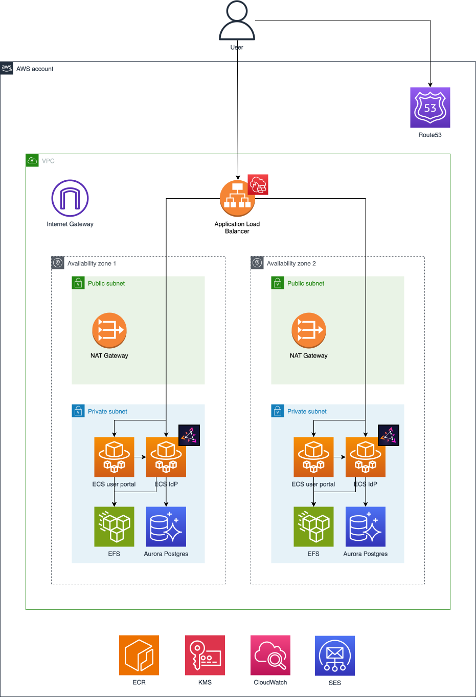
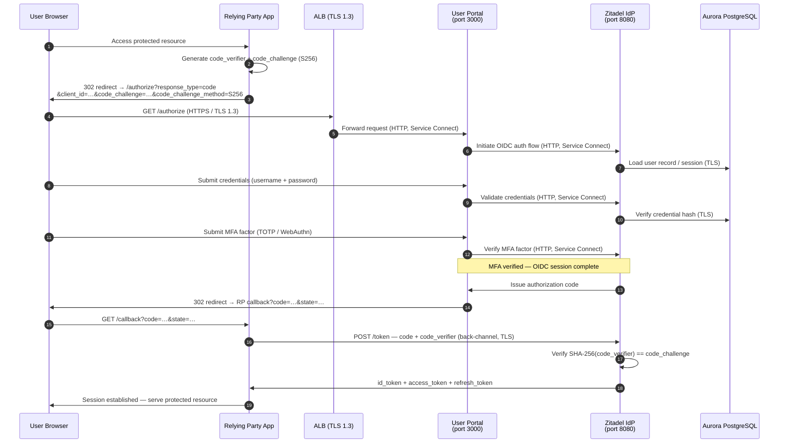

# System Architecture — Platform Unified Accounts (SSO/IdP)

- **Owner:** Canadian Digital Service — Platform Core Services  
- **Last updated:** 2026-07-02

---

## Table of Contents

1. [Overview](#1-overview)
2. [System Components](#2-system-components)
3. [Infrastructure & Deployment](#3-infrastructure--deployment)
4. [Network Architecture](#4-network-architecture)
5. [Authentication & Data Flows](#5-authentication--data-flows)
6. [Supporting Services](#6-supporting-services)
7. [Security Controls Summary](#7-security-controls-summary)

---

## 1. Overview

Platform Unified Accounts is the centralised identity and authentication platform for the Canadian Digital Service (CDS) Platform Business Unit. It provides Single Sign-On (SSO) for Platform services.

**Core responsibilities:**

- Authenticate GC employees and service accounts using phishing-resistant MFA (TOTP and WebAuthn/FIDO2)
- Issue OIDC tokens consumed by downstream relying-party applications
- Manage user account lifecycle (onboarding, MFA enrolment, password reset, account disabling)
- Export a full audit trail to S3 and CloudWatch for compliance and incident response

All infrastructure runs in **AWS Canada (Central) — `ca-central-1`**, deployed via Terraform.

---

## 2. System Components

The system is composed of four runtime components and several AWS managed services.

### 2.1 Zitadel IdP

| Property | Value |
|---|---|
| Technology | [Zitadel](https://zitadel.com/) (open-source, self-hosted) |
| Runtime | AWS ECS Fargate, cluster `idp` |
| Source | `docker/idp/` |

Zitadel is the core identity provider. It handles all OIDC protocol work: token issuance, user management, MFA policy enforcement, and federation workflows. It is the source of truth for user identities and credentials.

Key configuration:
- `docker/idp/config.yaml`
- `docker/idp/steps.yaml`

### 2.2 User Portal

| Property | Value |
|---|---|
| Technology | Next.js, TypeScript |
| Runtime | AWS ECS Fargate, cluster `idp` |
| Source | [`cds-snc/platform-unified-accounts-user-portal`](https://github.com/cds-snc/platform-unified-accounts-user-portal) |

The User Portal is the Login V2 frontend for Zitadel. End users (apart from CDS staff) interact exclusively with the User Portal — they never touch Zitadel's built-in UI. The portal mediates all authentication flows:

- Login, MFA challenge (TOTP / WebAuthn)
- Password reset and email verification
- MFA enrolment and account self-service

Server-side route protection is enforced via the `AuthLevel` enum (`lib/server/route-protection.ts`) and `AuthenticatedAction` guards on all server actions. The portal communicates with the Zitadel API over the internal Service Connect namespace.

### 2.3 IdP Event Exporter (Lambda)

| Property | Value |
|---|---|
| Technology | Go (AWS Lambda) |
| Schedule | Every 5 minutes (EventBridge) |
| Source | `docker/idp-event-exporter/` |

A Lambda function that polls the Zitadel Admin API and writes audit event records as JSON to S3. It also logs `AEVT:`-prefixed lines to CloudWatch, which trigger a subscription filter → `alarms-slack` Lambda → Slack for security-relevant events (e.g., `instance.member.*`, `org.member.*`, `user.locked`).

### 2.4 IdP Deactivate Users (Lambda)

| Property | Value |
|---|---|
| Technology | Go (AWS Lambda) |
| Schedule | Every 24 hours (EventBridge) |
| Source | `docker/idp-deactivate-users/` |

A Lambda function that uses the Zitadel User and Events APIs to:

1. Retrieve all active human users.
2. For each user: 
   1. Determine their most recent activity date. This is based on either their most recent successful password check event or their account creation date.
   2. If the most recent activity is before the INACTIVE_DAYS cutoff, deactivate the user's account. 

### 2.5 Alarms Slack Lambda

| Property | Value |
|---|---|
| Technology | AWS Lambda |
| Source | `docker/alarms-slack/` |

Receives CloudWatch subscription filter notifications and forwards formatted alerts to a Slack channel. Acts as the alerting bridge for operational and security events.

---

## 3. Infrastructure & Deployment

All infrastructure is defined as Terraform in `terraform/aws/`. Environments are configured via `terraform/env/`.

### Key AWS Resources

| Resource | Purpose |
|---|---|
| **ALB** | Internet-facing entry point; routes to Zitadel and User Portal |
| **ECS Fargate** | Serverless container runtime for Zitadel and the User Portal |
| **Aurora PostgreSQL 17** | Serverless v2; Zitadel data store |
| **EFS** | Encrypted file system for User Portal personal access token |
| **S3** | Long-term audit event store |
| **Lambda** | Audit event export (every 5 min) |
| **ECR** | Container image registry |
| **SSM Parameter Store** | KMS-encrypted secrets injected into ECS task definitions |
| **AWS SES** | Transactional email (OTP codes, email verification) |
| **AWS KMS** | Customer-managed keys for CloudWatch/SNS encryption |

### CI/CD

- GitHub Actions pipelines are used to:
   - build and push container images to ECR, 
   - manage ECS task deployments, 
   - run Terraform infrastructure operations, and
   - perform static/dynamic application security testing.
- Deployments use **OIDC role assumption** — no static AWS credentials are stored

---

## 4. Network Architecture



All ECS tasks and the Lambda run in **private subnets** with no direct internet access. Egress to AWS services (ECR, SSM, CloudWatch, RDS, S3) uses **VPC endpoints**, avoiding NAT traversal.

### Ports & Protocols

| Port | Protocol | Service | Direction | Internet-routable |
|---|---|---|---|---|
| 443 | HTTPS / TLS 1.3 | ALB | Ingress | Yes |
| 80 | HTTP | ALB (redirect) | Ingress | Yes |
| 8080 | HTTP | Zitadel IdP | Internal | No |
| 3000 | HTTP | User Portal | Internal | No |
| 5432 | PostgreSQL / TLS | Aurora | Egress (private) | No |
| 2049 | NFS / TLS | EFS | Egress (private) | No |
| 465 | SMTP TLS | SES (email) | Egress | No |
| 443 | HTTPS | VPC Endpoints | Egress (VPC) | No |

---

## 5. Authentication & Data Flows

### 5.1 Human Authentication Flow



**MFA enforcement:** All human users are required to complete a second factor (TOTP or WebAuthn/FIDO2) on every login. This is enforced by the User Portal before it completes the OIDC session with Zitadel.

### 5.2 Audit Event Flow

```
1. Lambda (every 5 min)   ──►  Zitadel Admin API (internal)
2. Lambda                 ──►  S3: idp-event-exporter-{env}  (JSON records)
3. Lambda CloudWatch logs ──►  Subscription filter
4. Subscription filter    ──►  alarms-slack Lambda  ──►  Slack
```

Security-relevant events (admin membership changes, `user.locked`) trigger Slack alerts.

### 5.3 Privileged / Administrative Flow

```
1. Admin  ──►  ALB / User Portal (same path as end users, phishing-resistant MFA required)
2. Admin  ──►  Zitadel Admin Console (via browser, organisation-admin PAT)
3. CI/CD  ──►  GitHub Actions OIDC role  ──►  Terraform / ECR / ECS
```

No static AWS credentials are used in CI/CD. All infrastructure changes flow through Terraform with OIDC-based role assumption.

---

## 6. Supporting Services

### Data Protection

| Data | Storage | Protection |
|---|---|---|
| User identities, credentials, MFA factors | Aurora PostgreSQL | Encrypted at rest (AES-256); TLS in transit |
| User Portal PAT | SSM SecureString | KMS-encrypted (CMK); key rotation enabled |
| Audit events | S3 (versioned) | Server-side encryption; |
| OIDC tokens | Browser / TLS in-flight | Short-lived (30 min); HTTP-only cookies for refresh tokens |

### DNS & Email

- **Route 53** hosts the IdP domain with SPF, DKIM, and DMARC records
- **DNS Firewall** enforces an explicit allowlist for resolver queries (prevents data exfiltration via DNS)
- **SES** sends all transactional email with DKIM signing

### Monitoring & Alerting

- **CloudWatch** collects ECS, Lambda, and ALB logs
- **Athena** queries WAF and ALB logs for ad-hoc investigation
- **Slack** receives real-time security event alerts via the `alarms-slack` Lambda
- **AWS Shield Advanced** provides automatic DDoS response at the ALB and Route 53 levels

---

## 7. Security Controls Summary

| Area | Mechanism |
|---|---|
| Network perimeter | AWS Shield Advanced, WAFv2 (Bot Control, rate limiting, geo restriction), Security Groups, NACLs |
| Authentication | Phishing-resistant MFA required for all human users (TOTP + WebAuthn/FIDO2) |
| Authorisation | Zitadel OIDC protocol; User Portal route guards; AWS IAM least-privilege task roles |
| Secrets management | SSM Parameter Store (KMS SecureString); no secrets in environment variables or source code |
| Audit trail | Zitadel events → S3 (5-min cadence); VPC Flow Logs, ALB, WAF logs → CBS Satellite S3 |
| Data encryption | TLS 1.3 on all external traffic; TLS on database and EFS; AES-256 at rest |
| Supply chain | ECR image lifecycle; Dependabot/Renovate; no static CI/CD credentials (OIDC role) |
| Availability | Dual-AZ VPC; Aurora Serverless v2 auto-scaling; Fargate managed scheduling |
